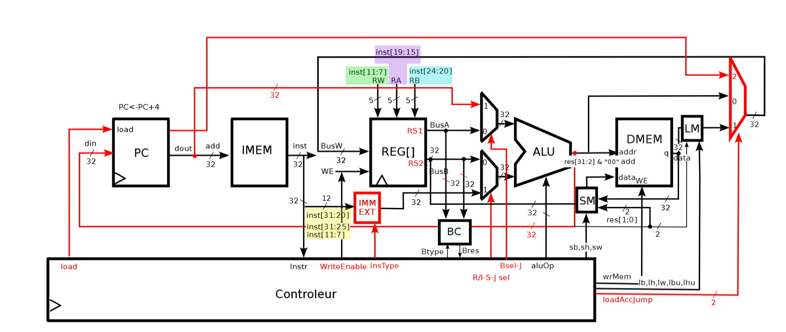
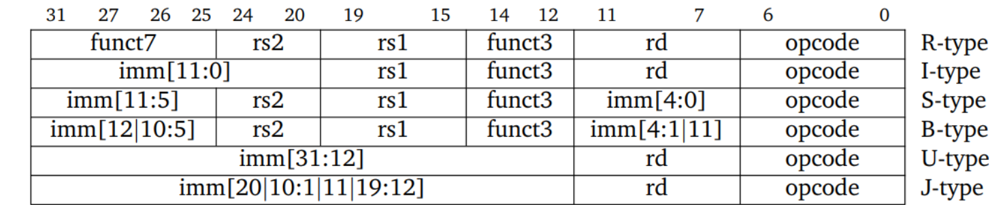
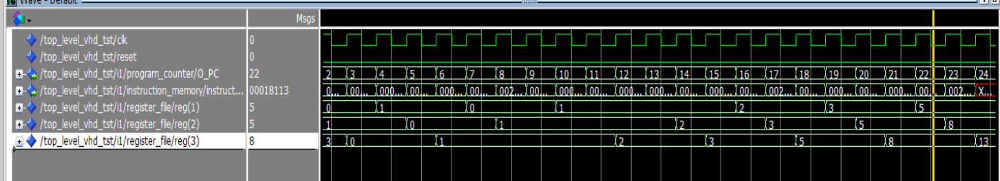

# RV32I Processor Project

## Overview
This project implements a RISC-V 32-bit (RV32I) processor architecture using VHDL. The primary goal is to design, simulate, and validate the processor components on an FPGA platform (Altera/Intel DE1-SoC). This README provides a detailed explanation of the architecture, core components, instruction set, and validation through simulation.

## Architecture
The RV32I processor follows a pipelined architecture that consists of several key components:

1. **Register File**: 
   - Contains 32 general-purpose registers (x0-x31), each 32 bits wide.
   - The x0 register is hardwired to zero.
   - Operands are read from registers specified by the instruction (rs1, rs2) and the result is written back to the destination register (rd).

2. **Program Counter (PC)**:
   - Holds the address of the current instruction.
   - Increments automatically by 4 to point to the next instruction in memory.

3. **Instruction Memory (IMEM)**:
   - Stores the program instructions.
   - Read-only memory that fetches instructions during execution.

4. **Data Memory (DMEM)**:
   - Stores data used by the program.
   - Accessible through load/store instructions.

5. **Arithmetic Logic Unit (ALU)**:
   - Performs arithmetic and logical operations.
   - Supports immediate and register-based operations.
   
   
### Architecture Diagram

## Instruction Set
The RV32I architecture supports several types of instructions:
- **R-Type**: Register-based operations (e.g., `add`, `sub`).
- **I-Type**: Immediate operations (e.g., `addi`, `lw`).
- **S-Type**: Store operations (e.g., `sw`).
- **B-Type**: Branch instructions (e.g., `beq`, `bne`).
- **J-Type**: Jump instructions (e.g., `jal`).
- **U-Type**: Upper immediate instructions (e.g., `lui`).

### Instruction Opcode

## Simulation and Validation
The validation of the processor components is done through a comprehensive simulation setup:

### Main Testbench
The main testbench simulates a **Fibonacci algorithm** to validate the core components of the RV32I processor. The simulation ensures that the processor correctly executes the algorithm, demonstrating the functionality of the entire architecture.

## Code and Test Files

In the directory **"Code mémoire RISCV + fichiers de test,"** you can find all the assembly codes designed to test each component of the RV32I processor for all types of instructions. Each assembly file has been compiled into hex code for easy integration with the instruction memory.

### Usage Instructions:
- To run a testbench, simply add the desired hex file corresponding to the specific assembly code you want to test in the instruction memory (IMEM).
- Ensure that the hex file contains the correct instructions for the functionality you wish to validate in the testbench.

This structured approach allows for focused testing of individual components while ensuring comprehensive coverage of the instruction set.

### Individual Component Testbenches
Each core component of the processor has its dedicated testbench:
- **ALU Testbench**: Tests all arithmetic and logical operations supported by the ALU.
- **Decoder Testbench**: Validates instruction decoding and proper operation selection.
- **Register File Testbench**: Checks read and write operations in the register file.
- **IMEM and DMEM Testbenches**: Simulate memory operations for instruction and data access.

## Fibonacci Numerical Suite
The Fibonacci numerical suite is a classic algorithm that generates Fibonacci numbers, where each number is the sum of the two preceding ones. This sequence starts with 0 and 1, and the nth Fibonacci number can be defined as:

- \( F(0) = 0 \)
- \( F(1) = 1 \)
- \( F(n) = F(n-1) + F(n-2) \) for \( n > 1 \)

The Fibonacci sequence has numerous applications in computer science, mathematics, and nature. In this project, the Fibonacci algorithm is utilized to test the processor’s functionality and ensure the proper execution of instructions.

### Fibonacci Testbench Simulation
The following image illustrates the testbench designed for the Fibonacci algorithm simulation:

This testbench validates the core components of the RV32I processor by executing the Fibonacci algorithm and checking the results against expected outputs.

## Installation and Usage
To run the simulations:
1. Ensure you have an FPGA development environment set up (Intel Quartus).
2. Load the VHDL source files and testbenches into the software.
3. Compile the design and run the simulations.
4. Analyze the results for correctness and performance.

